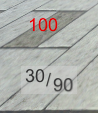
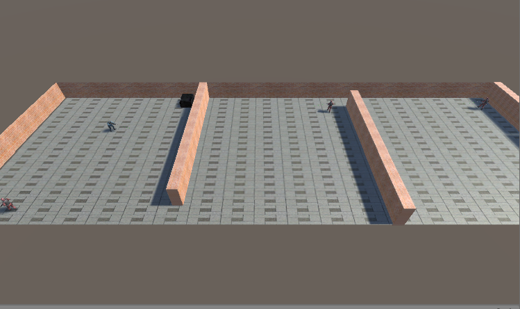
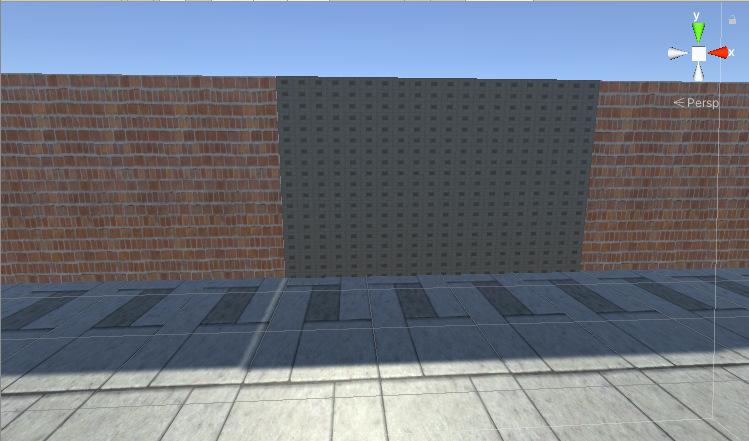
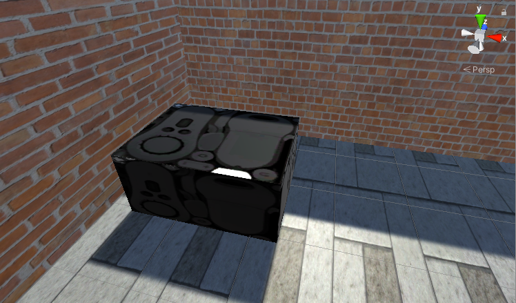
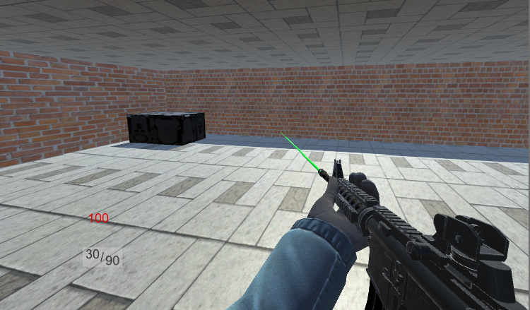
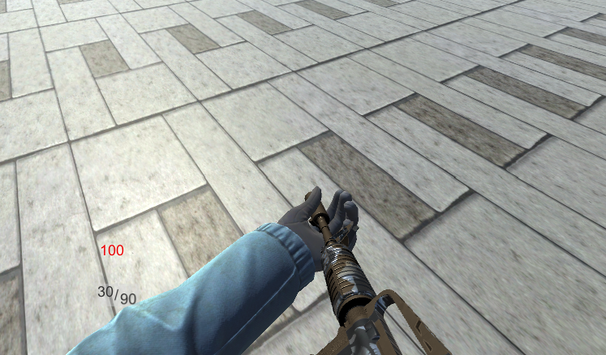

# Assignment3--FIRST PERSON SHOOTER IN UNITY

## Notice: I finished two more parts of bonus after demo session and show them at the end of this file.

## 1.1 IMPLEMENTATION

### 1.1.1 ENEMY CHARACTER  

In the script "enemy" tied with character "enemy", the function "Walking()" implements the effect where the enemy walks in a predefined path. The path (named "Walkpath" in Hierarchy) consists of 4 predefined 3D points named "target1", "target2", "target3", "target4" respectively.  The codes are shown as follows:
```csharp
void Walking()
{
    float dist = Vector3.Distance(transform.position, targets[currentTarget].transform.position);
    transform.rotation = Quaternion.Lerp(transform.rotation, Quaternion.LookRotation(targets[currentTarget].transform.position - transform.position), Time.deltaTime);
    if(dist < 0.4f)
    {
        currentTarget++;
        if(currentTarget == 4)
        {
            currentTarget = 0;
        }
    }
}
```
The enemy characters are assigned with the red uniform whose texture is *Soldier_Body_diffuse_red.png*.  

### 1.1.2 DETECTING PLAYER
In the script "enemy" tied with character "enemy", the function "DetectPlayer()" enables the enemy to detect the player. If the distance between enemy and player as well as difference of face direction between enemy and player are less than the given values, the function "DetectPlayer()" returns true.
```csharp
bool DetectPlayer()
{
    float dist_with_player = Vector3.Distance(transform.position, player.transform.position);
    Vector3 playerDir = player.transform.position - transform.position;
    float angle_with_player = Vector3.Angle(playerDir, transform.forward);

    if(dist_with_player < 16.0f && Mathf.Abs(angle_with_player) < 50.0f)
    {
        return true;
    }
    else
    {
        return false;
    }        
}
```
In the script "enemy" tied with character "enemy", the following codes in the function "Update()" calculate the distance between enemy and player. When the enemy finds the player, if the distance is greater than 10m, then the enemy would run up to the player until the distance is exactly 10m. Otherwise, the enemy would shoot the player directly.
```csharp
transform.LookAt(player.transform);
transform.rotation = Quaternion.Lerp(transform.rotation, Quaternion.LookRotation(playerBodyPose - enemyPos), Time.deltaTime);
if(dist > 10.0f)
{
    animator.SetBool("run", true);
    animator.SetBool("shooting", false);
}
else
{
    animator.SetBool("run", false);
    nimator.SetBool("shooting", true);
}
```
### 1.1.3 ENEMY SHOOTING THE PLAYER
As said in 1.1.2, the enemy shoots the player when detecting and reaching the distance of 10 meters to the player. In the script "enemy" tied with character "enemy", the following codes in the function "Shooting()" use RaycastHit and Physics.Raycast to shoot. The random vector is added to the Raycast so that the 20% of the times enemy bullets hit the player.
```csharp
RaycastHit rayHit;
int layerMask = 1<<8;
layerMask = ~layerMask;
Vector3 randomDir = new Vector3(Random.Range(-0.2f, 0.2f), Random.Range(-0.2f, 0.2f), Random.Range(-0.2f, 0.2f));
Vector3 endPos = transform.TransformVector(randomDir);
if(Physics.Raycast(end.transform.position + endPos, ((end.transform.position + endPos) - start.transform.position).normalized, out rayHit, 100.0f))
```
In the function "Update()", the following codes control the fire rate by setting the related value and calculating the running time.
```csharp
if(Time.time > fireRate + lastShot)
{
    Shooting();
    addEffects();
    lastShot = Time.time;
}
```
In the script "Gun" tied with character "player", the following codes in the function "Being_shot()" reduce the health of player if shot. When the health is less than or equal to zero, the function trigger the death aniamtion.

```csharp
public void Being_shot(float damage) // getting hit from enemy
{
    health -= damage;
    if(health <= 0)
    {
        isDead = true;
        animator.SetBool("dead", true);
        GetComponent<CharacterMovement>().isDead = true;
        GetComponent<CharacterController>().enabled = false;

        Debug.Log("You Failed. Restart after 10 seconds");
        Invoke("Restart", 10);
    }
}
```
### 1.1.4 ENEMY SHOOTING THE PLAYER
In the script "Gun" tied with character "player", the following codes in the function "shotDetection()" utilize Physics.Raycast to shoot the enemy. 
```csharp
RaycastHit rayHit;
if(Physics.Raycast(end.transform.position, (end.transform.position - start.transform.position).normalized, out rayHit, 100.0f))
{
    print(rayHit.transform.tag);
    if(rayHit.transform.tag == "enemy1")
    {
        rayHit.transform.GetComponent<enemy>().Shot(20);
    }
}
```

If the enemy is shot, then the function "Shot()" in the script "enemy" tied with character "enemy" runs, as shown in the following codes. If the health is less than or equal to zero, the function triggers the death aniamtion of enemy. Then the rigidbody and collider are added to the gun. The variable "shot" would change its state to "true", meaning that the enemy is shot which is useful for controlling the state of enemy.
```csharp
public void Shot(float num)
{
    float healthLoss = 20;

    healthLoss = num;
    health -= healthLoss;
    shot = true;

    if(health <= 0)
    {
        dead = true;
        animator.SetBool("shooting", false);
        animator.SetBool("die", true);

        GetComponent<CharacterController>().enabled = false;

        gun.transform.parent = null;
            
        gun.AddComponent<BoxCollider>();
        gun.GetComponent<BoxCollider>().size = new Vector3(0.2f, 0.45f, 1.2f);
        gun.AddComponent<Rigidbody>();
        gun.AddComponent<Rigidbody>().mass = 5;
        gun.AddComponent<Rigidbody>().useGravity = true;
    }
}
```
In the script "Gun" tied with character "player", the following codes in the function "updateText()" update the health of player shown in the UI Canvas with red color.
```csharp
void updateText()
{
    magBullets.text = magBulletsVal.ToString() ;
    remainingBullets.text = remainingBulletsVal.ToString();
    playerHealth.text = health.ToString();
}
```
The health of player in the UI Canvas:




### 1.1.5 GAME ENVIRONMENT
In the script "Gun" tied with character "player", the following codes in the function "OnTriggerEnter()" detect if the player colliders with the escape door. When escaping from the door, the game would restart after ten seconds after showing "Mission Completed! Restart after 10 seconds" in console.

```csharp
void OnTriggerEnter(Collider collider)
{

    if(collider.gameObject.name == "Door")
    {
        Debug.Log("Mission Completed! Restart after 10 seconds");
        Invoke("Restart", 10);
    }

    if(collider.gameObject.name == "AmmoCrates")
    {
        magBulletsVal = 30;
        remainingBulletsVal = 90;
    }
}
```
As shown in the following codes, the game would restart in 10 seconds with "You Failed. Restart after 10 seconds" showing in console when player is killed by enemy. 
```csharp
public void Being_shot(float damage) // getting hit from enemy
{
    health -= damage;
    if(health <= 0)
    {
        isDead = true;
        animator.SetBool("dead", true);
        GetComponent<CharacterMovement>().isDead = true;
        GetComponent<CharacterController>().enabled = false;

        Debug.Log("You Failed. Restart after 10 seconds");
        Invoke("Restart", 10);
    }
}
```
Mutiple rooms and enemies in the scene:



Escape door:




## 1.2 BONUS
### 1.2.1 AMMUNITION SUPPLY
In the script "Gun" tied with character "player", the following codes in the function "OnTriggerEnter()" detect if the player colliders with the ammo crates. If true, the number of bullets in total and that in magazine would be reset as the allowed maximum.

```csharp
void OnTriggerEnter(Collider collider)
{

    if(collider.gameObject.name == "Door")
    {
        Debug.Log("Mission Completed! Restart after 10 seconds");
        Invoke("Restart", 10);
    }

    if(collider.gameObject.name == "AmmoCrates")
    {
        magBulletsVal = 30;
        remainingBulletsVal = 90;
    }
}
```

Ammo crates:



#

## Notice: the above is the parts that I have shown in the demo session. The following is the parts I managed to implement after the demo.
#

### 1.2.2 ENEMIES GETTING COVER
Sorry, I failed to implement this part.

### 1.2.3 DETECTING BODY PART HITS
In the script "Gun" tied with character "player", the following codes in the function "shotDetection()" detect at which part of enemy the player is shooting. Based on the different tags of body parts, the enemy would get shot with different damage values.
```csharp
void shotDetection() // Detecting the object which player shot 
{
    RaycastHit rayHit;
    if(Physics.Raycast(end.transform.position, (end.transform.position - start.transform.position).normalized, out rayHit, 100.0f))
    {
        if(rayHit.transform.tag == "enemy1")
        {
            rayHit.transform.GetComponent<enemy>().Shot(20); 
        }
        else if(rayHit.transform.tag == "enemy1Head")
        {
            enemy1.GetComponent<enemy>().Shot(100);
        }
        else if(rayHit.transform.tag == "enemy1Hands")
        {
            enemy1.GetComponent<enemy>().Shot(10);
        }
        else if(rayHit.transform.tag == "enemy1Chest")
        {
            enemy1.GetComponent<enemy>().Shot(30);
        }
        else if(rayHit.transform.tag == "enemy1Legs")
        {
            enemy1.GetComponent<enemy>().Shot(20);
        }
        else if(rayHit.transform.tag == "enemy2")
        {
            rayHit.transform.GetComponent<enemy>().Shot(20);            
        }
        else if(rayHit.transform.tag == "enemy2Head")
        {
            enemy2.GetComponent<enemy>().Shot(100);
        }
        else if(rayHit.transform.tag == "enemy2Hands")
        {
            enemy2.GetComponent<enemy>().Shot(10);
        }
        else if(rayHit.transform.tag == "enemy2Chest")
        {
            enemy2.GetComponent<enemy>().Shot(30);
        }
        else if(rayHit.transform.tag == "enemy2Legs")
        {
            enemy2.GetComponent<enemy>().Shot(20);
        }
        else if(rayHit.transform.tag == "enemy3")
        {
            rayHit.transform.GetComponent<enemy>().Shot(20);             
        }
        else if(rayHit.transform.tag == "enemy3Head")
        {
            enemy3.GetComponent<enemy>().Shot(100);
        }
        else if(rayHit.transform.tag == "enemy3Hands")
        {
            enemy3.GetComponent<enemy>().Shot(10);
        }
        else if(rayHit.transform.tag == "enemy3Chest")
        {
            enemy3.GetComponent<enemy>().Shot(30);
        }
        else if(rayHit.transform.tag == "enemy3Legs")
        {
            enemy3.GetComponent<enemy>().Shot(20);
        }
        else
        {
            GameObject bulletHoleObejct = Instantiate(bulletHole, rayHit.point + rayHit.collider.transform.up*0.01f, rayHit.collider.transform.rotation);
            Destroy(bulletHoleObejct,2.0f);
        }    
    }
}
```
The same as the above function, in the script "enemy" tied with character "enemy", the following codes in the function "Shooting()" detect at which part of player the enemy is shooting. Based on the different tags of body parts, the player would get shot with different damage values.
```csharp
void Shooting()
{
    RaycastHit rayHit;
    Vector3 randomDir = new Vector3(Random.Range(-0.2f, 0.2f), Random.Range(-0.2f, 0.2f), Random.Range(-0.2f, 0.2f));
    Vector3 endPos = transform.TransformVector(randomDir);
    if(Physics.Raycast(end.transform.position + endPos, ((end.transform.position + endPos) - start.transform.position).normalized, out rayHit, 100.0f))
    {
        if(rayHit.transform.tag == "Player")
        {
            rayHit.transform.GetComponent<Gun>().Being_shot(20);
        }
        else if(rayHit.transform.tag == "playerHead")
        {
            player.GetComponent<Gun>().Being_shot(100);
        }
        else if(rayHit.transform.tag == "playerHands")
        {
            player.GetComponent<Gun>().Being_shot(10);
        }
        else if(rayHit.transform.tag == "playerChest")
        {
            player.GetComponent<Gun>().Being_shot(30);
        }
        else if(rayHit.transform.tag == "playerLegs")
        {
            player.GetComponent<Gun>().Being_shot(20);
        }
        else
        {
            GameObject bulletHoleObejct = Instantiate(bulletHole, rayHit.point + rayHit.collider.transform.up*0.01f, rayHit.collider.transform.rotation);
            Destroy(bulletHoleObejct,2.0f);
        }  
    }
}
```

### 1.2.4 SWAPPING GUNS
In the script "Gun" tied with character "player", the following codes in the funciton "Update()" and function "SwapEvent()" implement the effect where the player is able to swap the two weapons by turns with the Q key.
```csharp
if(Input.GetKeyDown(KeyCode.Q))
{
    animator.SetBool("swap", true);
    currentGun = (currentGun+1)%2;
    SwapEvent(currentGun);
}
else
{
    animator.SetBool("swap",false);
}
```
```csharp
void SwapEvent(int currentGun)
{
    if(currentGun == 0)
    {
        gun.gameObject.SetActive(false);
        secondGun.gameObject.SetActive(true);
    }
    else
    {
        gun.gameObject.SetActive(true);
        secondGun.gameObject.SetActive(false);
    }  
}
```
Swap the guns:

the first weapon


the second weapon



